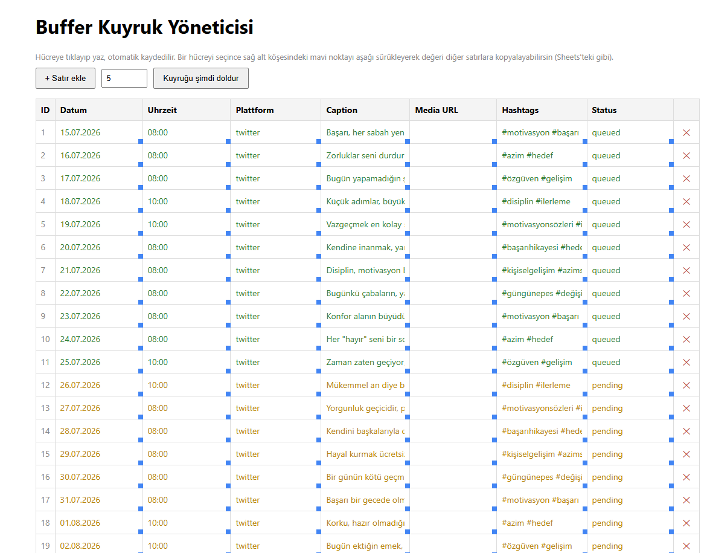

# Buffer Kuyruk Yöneticisi

Buffer'daki bir kanalın kuyruğunu belirlediğin sayıda (varsayılan 10) sürekli dolu tutan basit bir araç. Kendi postlarını bir tabloya yazıyorsun, script Buffer'da boş yer oldukça sırayla ekliyor.

## Önizleme



## Kurulum (Mac)

1. **Python kontrolü** — Terminal'de:
   ```
   python3 --version
   ```
   Yoksa: `brew install python` (Homebrew yoksa önce [brew.sh](https://brew.sh) üzerinden kur).

2. **Bu klasöre gir ve bağımlılıkları kur:**
   ```
   cd /path/to/buffer-scheduler-share
   pip3 install -r requirements.txt
   ```

3. **Kendi Buffer API key'ini al** (bu adımı ATLAMA — buradaki `.env.example` içinde gerçek key yok, kendi Buffer hesabınla oluşturman lazım):
   - Buffer hesabına giriş yap: https://publish.buffer.com/settings/api
   - Yeni bir API key oluştur, kopyala.

4. **`.env` dosyasını oluştur:**
   ```
   cp .env.example .env
   ```
   Sonra `.env`'i bir metin editörüyle aç ve doldur:
   - `BUFFER_API_KEY` → 3. adımda aldığın key.
   - `BUFFER_PROFILE_SERVICE` → hangi platforma post atacaksan (`twitter`, `instagram`, `linkedin`, `facebook` vb. — Buffer'a bağladığın kanalın servis adı).
   - `QUEUE_LIMIT` → kuyrukta sürekli kaç post tutulsun (varsayılan 10).

5. **Uygulamayı çalıştır:**
   ```
   python3 app.py
   ```
   Tarayıcıda **http://127.0.0.1:5000** aç.

6. **Postları ekle:** Tablodaki "+ Satır ekle" ile satır aç, hücrelere tıklayıp Datum (GG.AA.YYYY), Uhrzeit (SS:DD), Caption, Hashtags vb. yaz — otomatik kaydedilir. Bir hücreyi seçip sağ alt köşesindeki mavi noktayı aşağı sürükleyerek değeri diğer satırlara kopyalayabilirsin (spreadsheet mantığı).

7. **İlk dolumu yap:** Sayfadaki "Kuyruğu şimdi doldur" butonuna bas.

## Otomatik çalıştırma (opsiyonel ama önerilir)

Bunu kurmazsan, kuyruk sadece sen "Kuyruğu şimdi doldur"a bastığında dolar. Otomatik/kendi kendine çalışması için `cron` ile periyodik çalıştır:

```
chmod +x run_scheduler.sh
crontab -e
```

Açılan editöre şu satırı ekle (her saat başı çalıştırır — klasörün tam yolunu kendi bilgisayarına göre değiştir):

```
0 * * * * /tam/yol/buffer-scheduler-share/run_scheduler.sh
```

Kaydedip çık. Artık bilgisayarın açık olduğu her saatte arka planda otomatik çalışır. Logları `scheduler_log.txt` içinde görürsün.

## Not

- `posts.json` senin post listeni tutar, boş başlıyor — kendi postlarını sen eklersin.
- `.env` dosyası gizli bilgi içerir, kimseyle paylaşma / hiçbir yere yükleme.
- Buffer Free plan'da kanal başına kuyruk limiti olabilir; `QUEUE_LIMIT`'i buna göre ayarla.
